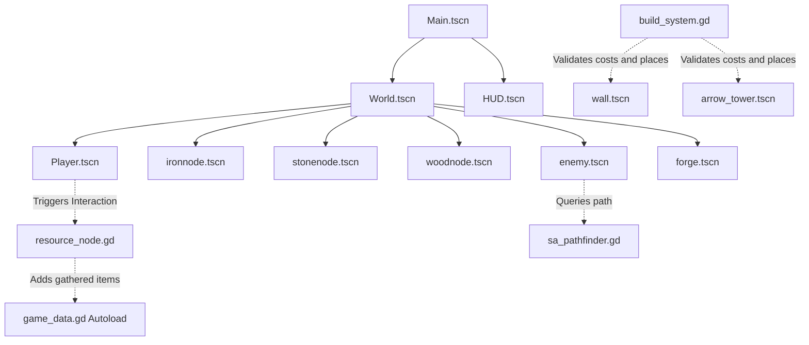

# Forge and Survive

Forge and Survive is a top-down 2D resource-gathering and survival game prototype built with Godot 4.6. It features character movement, an area-based interaction system, a centralized global game state to manage gathered resources, and advanced pathfinding algorithms.

## Project Structure

The project is structured logically, separating scenes, scripts, and static assets:

```
forge-and-survive/
├── assets/
│   └── sprites/
│       ├── enemy_1.png         # Spritesheet asset for enemies
│       ├── player.png          # Spritesheet asset for player
│       └── terrain_tiles/      # Terrain tiles and environment assets
├── SA_prototype/
│   ├── sa_prototype.py         # Python simulated annealing prototype
│   └── sa_result.png           # Exported visual result of python prototype
├── scenes/
│   ├── Main.tscn               # Root scene linking the world and HUD
│   ├── Enemy/
│   │   ├── enemy.tscn          # Raider scene setup
│   │   ├── marker_2d.tscn      # Map border spawn marker
│   │   └── Wave_manager.gd     # Spawning logic and wave progression
│   ├── player/
│   │   └── player.tscn         # Player node composition
│   ├── structures/
│   │   ├── forge.tscn          # Central Forge objective
│   │   └── wall.tscn           # Defensive wall asset
│   ├── ui/
│   │   ├── HUD.tscn            # Head-up display layout
│   │   ├── arrow_tower.tscn    # Automated defense tower scene
│   │   ├── defeat_screen.tscn  # Game over screen
│   │   └── VictoryScreen.tscn  # Game won screen
│   └── world/
│       ├── World.tscn          # Main level scene with player and nodes
│       ├── ResourceNode.tscn   # Base interactive resource node
│       ├── ironnode.tscn       # Prefab for Iron nodes
│       ├── stonenode.tscn      # Prefab for Stone nodes
│       └── woodnode.tscn       # Prefab for Wood nodes
└── scripts/
    ├── ai/
    │   └── sa_pathfinder.gd    # Simulated Annealing pathfinding algorithm
    ├── Enemies/
    │   ├── Raiderbody.gd       # Alternate Raider behavior using SA
    │   └── enemy_health.gd     # Main enemy movement and state controller
    ├── player/
    │   └── player.gd           # Character movement and physical behavior
    ├── structures/
    │   └── arrow_tower.gd      # Tower target scanning and shooting logic
    ├── ui/
    │   ├── defeat_screen.gd    # Defeat screen options
    │   ├── hud.gd              # Resource and timer UI controller
    │   └── victory_screen.gd   # Victory screen options
    └── systems/
        ├── build_system.gd     # Grid snapping and construction logic
        ├── day_night_overlay.gd# Dark canvas shading for night transition
        ├── forge.gd            # Core objective health controller
        ├── game_data.gd        # Global autoload singleton tracking inventory
        ├── game_loop.gd        # Core cycle controller for day/night phases
        ├── resource_spawner.gd # Spawn controller for resource nodes
        └── structure_health.gd # Base health component for defenses
```

## System Architecture

The prototype is built around a decoupled architecture where the player, interactive items, defenses, enemies, and game state communicate seamlessly using standard Godot patterns.



### 1. Global State Management (Autoload)
* **File:** `scripts/systems/game_data.gd`
* **Purpose:** Acts as a centralized inventory manager that persists across scenes.
* **Details:**
  * Maintains an internal dictionary of resource counts: `iron`, `wood`, and `stone`.
  * Provides a public method `add_resource(type: String, amount: int)` to safely manipulate inventory counts and print debug state.

### 2. Player Controller
* **File:** `scripts/player/player.gd`
* **Purpose:** Handles physics-based movement and collision detection.
* **Details:**
  * Inherits from `CharacterBody2D`.
  * Normalizes 8-directional input via WASD or arrow keys.
  * Moves at a velocity of `150.0` pixels per second.

### 3. Proximity Interaction System
* **File:** `scenes/world/resource_node.gd`
* **Purpose:** Generic template logic for any interactive world object.
* **Details:**
  * Inherits from `Area2D` and handles proximity state inside custom groups.
  * Employs `body_entered` and `body_exited` signals to detect nodes belonging to the `player` group.
  * Listens for the `interact` action (mapped to the physical **E** key).
  * Calls `GameData.add_resource(...)` and queues itself for destruction (`queue_free()`) upon collection.

### 4. Build System & Grid Snapping
* **File:** `scripts/systems/build_system.gd`
* **Purpose:** Grid placement controller for player defenses.
* **Details:**
  * Uses 32x32 tiles for grid snapping coordinates.
  * Displays a visual semi-transparent ghost preview following the mouse cursor.
  * Validates material costs against `GameData.resources` before instantiating scenes.

### 5. Day/Night Game Loop
* **File:** `scripts/systems/game_loop.gd`
* **Purpose:** Drives the core phase transitions.
* **Details:**
  * Day (Build Phase): 20 seconds. Player has freedom to collect resources and place structures.
  * Night (Defense Phase): Spawn raiders from map edges. Building actions are locked until all wave enemies are eliminated.
  * Shading is controlled via `day_night_overlay.gd` which toggles visibility of a dark CanvasLayer overlay.

### 6. Simulated Annealing Pathfinding
* **File:** `scripts/ai/sa_pathfinder.gd`
* **Purpose:** AI path calculation utilizing local search optimization.
* **Details:**
  * Finds an initial path using Breadth-First Search (BFS).
  * refines waypoints using simulated annealing over 300 iterations.
  * Calculates path cost by factoring in distance, Wall penalties (weight 1000.0), and Spike Trap penalties (weight 50.0).
  * Dynamically accepts sub-optimal route mutations based on a falling cooling temperature, creating varied and natural raider approach patterns.

## Inputs and Controls

The input system defines the following key mappings in `project.godot`:

* **Movement:** 
  * Up: `W` or `Up Arrow`
  * Down: `S` or `Down Arrow`
  * Left: `A` or `Left Arrow`
  * Right: `D` or `Right Arrow`
* **Actions:**
  * Toggle Build Mode: `B` (action `toggle_build`)
  * Select Wall Structure: `1` (action `select_wall`)
  * Select Tower Structure: `2` (action `select_tower`)
  * Place Structure: `Left Mouse Button` (action `place`)
  * Gather Resource: `E` (action `interact`)

## Getting Started

1. Open the project in Godot Engine 4.6.
2. Run `scenes/Main.tscn` to start the game prototype.
3. Walk to resource nodes (wood, iron, stone) and press **E** to collect them.
4. Press **B** to enter Build Mode. Toggle between Wall (press **1**) and Tower (press **2**) and left-click to construct defenses.
5. Survive waves of raiders by protecting the central Forge.

---

## Development Roadmap & Status

This detailed developmental roadmap tracks the 7-phase implementation goal established in the HTML Dev Roadmap, noting completion status, files involved, and functionality details.

### Phase 1: Project Setup

#### Milestone 1.1: Install Tools & Create Godot Project
* **Status:** Completed
* **Associated Files:** `project.godot`, `.editorconfig`
* **Details:** A clean Godot 4.x project is initialized in a designated folder using the Compatibility renderer, establishing standard settings for top-down 2D pixel art. The folder structure segregates scenes, scripts, and static assets.

#### Milestone 1.2: GitHub Setup & First Commit
* **Status:** Completed
* **Associated Files:** `.gitignore`, `.gitattributes`
* **Details:** Git repository initialized from start. Gitignore file actively ignores auto-generated files (`.godot/`, `*.import`, `export_presets.cfg`) to ensure repo cleanliness.

#### Milestone 1.3: Scene Architecture — The Master Scene
* **Status:** Completed
* **Associated Files:** `scenes/Main.tscn`, `scenes/world/World.tscn`, `scenes/ui/HUD.tscn`
* **Details:** Root hierarchy decoupling completed. `Main.tscn` acts as the coordinator, housing the dynamic `World` layer (where the player, terrain, and enemies live) and a CanvasLayer-driven `HUD` for independent screen-space UI render loops.

---

### Phase 2: Core Gameplay

#### Milestone 2.1: Tilemap & Basic Map
* **Status:** Completed
* **Associated Files:** `scenes/world/World.tscn` (TileMapLayer), `assets/sprites/terrain_tiles/`
* **Details:** Ground layouts mapped using Godot's modern `TileMapLayer` node at a locked 32x32 pixel tile grid size. Defined walkable grass, paths, and solid water boundaries.

#### Milestone 2.2: Player Movement
* **Status:** Completed
* **Associated Files:** `scenes/player/player.tscn`, `scripts/player/player.gd`
* **Details:** A CharacterBody2D-based controller that reads movement input vectors, normalizes 8-directional travel speed to exactly `150.0` pixels per second, and leverages a Camera2D to follow player positions dynamically.

#### Milestone 2.3: Resource Nodes & Gathering
* **Status:** Completed
* **Associated Files:** `scenes/world/ResourceNode.tscn`, prefabs (`ironnode.tscn`, `stonenode.tscn`, `woodnode.tscn`), `scripts/systems/game_data.gd`
* **Details:** Autoload singleton `GameData` acts as a global storage registry. Interactive nodes use Area2D collision zones to detect player proximity, capture keyboard inputs (**E**), increment inventory pools, and handle safe resource deletion and spawning.

#### Milestone 2.4: Basic HUD — Resource Counters
* **Status:** Completed
* **Associated Files:** `scenes/ui/HUD.tscn`, `scripts/ui/hud.gd`
* **Details:** Added user interface counters inside the `HUD` CanvasLayer, executing live text updates of `Iron`, `Wood`, and `Stone` counts directly linked to `GameData` state.

---

### Phase 3: Defense System

#### Milestone 3.1: Structure Placement System
* **Status:** Completed
* **Associated Files:** `scripts/systems/build_system.gd`
* **Details:** Pressing **B** swaps player state to build mode. Grid positions snap exactly to TILE_SIZE (32 pixels). Standard resource checks read cost requirements before spawning and deducting materials. Includes a visible preview cursor.

#### Milestone 3.2: Walls, Towers & Traps — Health System
* **Status:** In Progress
* **Associated Files:** `scenes/structures/wall.tscn`, `scenes/ui/arrow_tower.tscn`, `scripts/structures/arrow_tower.gd`, `scripts/systems/structure_health.gd`
* **Details:** 
  * Defensive walls correctly block enemy movement paths.
  * Automated Arrow Towers use Area2D circular range sensors to locate nearby targets, fire projectiles, and damage target health bars.
  * Base health component (`structure_health.gd`) handles damage intake, updates health states, and frees nodes when empty.
  * Remaining: Implementing standalone Spike Traps that trigger damage on contact.

---

### Phase 4: Enemy System

#### Milestone 4.1: Enemy Scene & Basic Spawning
* **Status:** Completed
* **Associated Files:** `scenes/Enemy/enemy.tscn`, `scripts/Enemies/enemy_health.gd`, `scenes/Enemy/Wave_manager.gd`
* **Details:** Wave manager is integrated to spawn waves of raiders at boundary locations. Spawning loops coordinate incremental raider counts scaling per wave. Basic combat logic allows raiders to seek and strike the central Forge or die when their health hits 0.

#### Milestone 4.2: A* Pathfinding — Enemies Navigate to Forge
* **Status:** Completed
* **Associated Files:** `scripts/ai/sa_pathfinder.gd`, `scripts/Enemies/enemy_health.gd`
* **Details:** Initial path calculation utilizes standard grid searching. Enemy movements leverage dynamic SEEK & AVOID state machines to adjust directions when physically blocked by walls, creating a smart avoidance navigation controller.

---

### Phase 5: Complete Game Loop

#### Milestone 5.1: Day/Night Cycle — Phase Switching
* **Status:** Completed
* **Associated Files:** `scripts/systems/game_loop.gd`, `scripts/systems/day_night_overlay.gd`
* **Details:** Core game loop state machine alternates between Day (Build) and Night (Defense) phases. Light shifts are achieved through `day_night_overlay.gd` utilizing overlay transparency. Spawner controls are disabled at night, forcing players to defend built structures.

#### Milestone 5.2: Victory & Defeat Conditions
* **Status:** Completed
* **Associated Files:** `scenes/ui/VictoryScreen.tscn`, `scenes/ui/defeat_screen.tscn`, `scripts/ui/victory_screen.gd`, `scripts/ui/defeat_screen.gd`
* **Details:** Fully functional end conditions. Victory screen displays when the final waves are successfully cleared. Defeat screen triggers immediately when the main Forge health component falls to 0. Includes Retry and Quit navigation handlers.

---

### Phase 6: AI Integration — Simulated Annealing

#### Milestone 6.1: Understanding Simulated Annealing
* **Status:** Completed
* **Associated Files:** `SA_prototype/sa_prototype.py`
* **Details:** Mathematical modeling of local search routing. Studied temperature cooling, probabilistic acceptances of sub-optimal waypoints, and obstacle penalties.

#### Milestone 6.2: Python Prototype (Before GDScript)
* **Status:** Completed
* **Associated Files:** `SA_prototype/sa_prototype.py`, `SA_prototype/sa_result.png`
* **Details:** Standalone prototype script created to isolate and test path optimization. Uses custom costs and coordinate tables to visual path variations around obstacles, successfully exporting a graphical model (`sa_result.png`).

#### Milestone 6.3: GDScript SA Integration
* **Status:** Completed
* **Associated Files:** `scripts/ai/sa_pathfinder.gd`
* **Details:** Fully integrated SA pathfinding into Godot. Algorithmic loops mutate routes via coordinate shifts, evaluate path costs using grid distances, apply wall and trap weights, and utilize temperature cooling models to generate optimized, unpredictable paths.

#### Milestone 6.4: Heat Meter UI Visualization
* **Status:** In Progress
* **Associated Files:** `scripts/ui/hud.gd`
* **Details:** The pathfinder exposes internal temperature metrics via Godot signals. Visual rendering of the colored temperature state bar is under active development.

---

### Phase 7: Polish

#### Milestone 7.1: UI — Full HUD & Menus
* **Status:** In Progress
* **Associated Files:** `scenes/ui/HUD.tscn`
* **Details:** Basic labels and timer layouts exist. Refined design aesthetics, build item palettes, and visual unified themes remain to be finalized.

#### Milestone 7.2: Art — Sprites & Animations
* **Status:** In Progress
* **Associated Files:** `assets/sprites/`
* **Details:** Animated walk and run textures are added for the player and enemy raider. Custom pixel animations for the central forge fire, projectile models, and map sprites are planned.

#### Milestone 7.3: Audio
* **Status:** Planned
* **Details:** Sound effects (combat, resource collection, build clicks) and ambient loops, along with master, sound effects, and music volume buses, are scheduled.

#### Milestone 7.4: Balancing & Save System
* **Status:** Planned
* **Details:** Tuning wave parameters, adjusting tower damage speeds, and creating dynamic JSON files to save player waves and resource amounts.